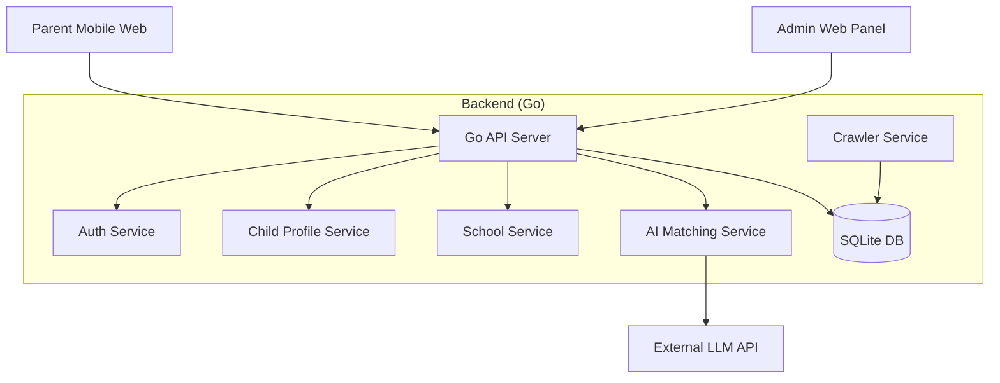

# 香港学校插班资讯系统 - 架构设计与实施状态 (Architecture & Implementation Status)

**最后更新**: 2026-01-03
**版本**: v0.5 (后端核心功能就绪)

## 1. 项目概述 (Project Overview)

**目标**: 为香港家长提供一个免费、易用且移动端友好的工具，用于查询、追踪和管理学校插班（Transfer/Admission）信息。系统支持多子女档案管理，并利用 AI 技术辅助简历分析和学校匹配。

### 核心价值
1.  **多子女管理**: 针对不同年级、性别的子女提供个性化的学校筛选。
2.  **信息整合**: 聚合分散在各校官网的插班资讯（HTML/PDF）。
3.  **智能匹配**: 利用 LLM/RAG 技术，根据学生简历与学校特色进行语义匹配。
4.  **移动优先**: 专为手机浏览器优化的 Web 体验。

---

## 2. 系统架构 (System Architecture)

### 2.1 技术栈 (Tech Stack)

| 组件 | 选型 | 状态 | 说明 |
| :--- | :--- | :--- | :--- |
| **Language** | Go (Golang) | ✅ 已实现 | 高性能，适合并发爬虫和 Web 服务 |
| **Web Framework** | Gin | ✅ 已实现 | 轻量级 RESTful API 框架 |
| **Database** | SQLite | ✅ 已实现 | 单文件数据库，无需运维，易备份 |
| **ORM** | GORM | ✅ 已实现 | 简化数据库操作与迁移 |
| **Auth** | JWT + Mock OTP | ✅ 已实现 | 基于 Token 的无状态认证 |
| **Frontend** | React + Vite + Tailwind | ⏳ 规划中 | 移动端优先的响应式 Web |
| **Crawler** | GoQuery + Chromedp | 🚧 进行中 | 通用爬虫框架已搭建，特定解析器开发中 |
| **AI/LLM** | OpenAI/Gemini API | ⏳ 规划中 | 用于简历分析和 RAG 问答 |

### 2.2 模块划分

---

## 3. 数据库设计 (Database Schema)

基于 `internal/model/model.go` 的实际实现：

### 3.1 核心实体

1.  **Users (用户表)**
    *   存储家长及管理员账户。
    *   字段: `Identifier` (手机/邮箱), `Role` (parent/admin), `PasswordHash` (仅管理员)。
    *   关联: 1个 User -> N个 ChildProfile。

2.  **ChildProfiles (子女档案表)**
    *   核心业务表，用于个性化筛选。
    *   字段: `Name`, `CurrentGrade` (e.g., P6), `Gender` (M/F), `TargetDistricts` (逗号分隔), `ResumeText` (AI 提取的简历文本)。
    *   关联: 1个 Child -> N个 Application。

3.  **Schools (学校基础表)**
    *   存储全港学校静态数据。
    *   字段: `Category` (直资/津贴等), `Banding` (Band 1/2/3), `Gender` (男/女/混校), `District` (地区), `MOI` (中英文教学), `WebsiteAdmission` (爬虫入口)。

4.  **AdmissionEvents (插班活动表)**
    *   存储动态的招生信息（核心价值数据）。
    *   字段: `ApplicationStartDate`, `ApplicationEndDate`, `InterviewDate`, `SourceURL`。

5.  **Applications (申请追踪表)**
    *   家长对自己关注学校的个人状态记录。
    *   字段: `Status` (interested, applied, interview, offer, rejected), `Notes`。

6.  **OTPCodes**
    *   临时存储验证码，用于登录验证。

---

## 4. API 接口清单 (API Endpoints)

### 4.1 认证 (Auth) - ✅ Completed
*   `POST /api/v1/auth/login`: 发送验证码 (Mock: 123456)
*   `POST /api/v1/auth/verify`: 验证并获取 JWT Token

### 4.2 子女管理 (Children) - ✅ Completed
*   `POST /api/v1/children`: 创建档案
*   `GET /api/v1/children`: 列表查询
*   `PUT /api/v1/children/:id`: 更新档案
*   `GET /api/v1/children/:id/matches`: **核心功能** - 获取与该子女匹配的学校列表 (基于性别、地区)

### 4.3 学校管理 (Schools) - ✅ Completed
*   `GET /api/v1/schools`: 搜索学校 (支持 query 参数: district, gender, banding, religion, name)
*   `POST /api/v1/schools`: 管理员新增学校
*   `PUT/DELETE /api/v1/schools/:id`: 管理员维护

### 4.4 申请追踪 (Applications) - ✅ Completed
*   `POST /api/v1/applications`: 添加关注/申请
*   `GET /api/v1/applications`: 查看申请列表
*   `PUT /api/v1/applications/:id`: 更新状态 (如改为 "Interview")

### 4.5 爬虫与 AI (Advanced) - 🚧 In Progress
*   `POST /api/v1/crawl`: 触发爬虫任务 (目前仅框架)
*   `POST /api/v1/chat`: AI 对话接口 (Mock)
*   `POST /api/v1/chat/resume`: 简历上传分析 (Mock)

---

## 5. 当前实施状态 (Implementation Status)

### ✅ 已完成 (Done)
1.  **后端基础架构**: Gin Server, SQLite DB, GORM Models, Migration, Seeding。
2.  **核心业务逻辑**:
    *   用户认证流程 (OTP + JWT)。
    *   多子女档案管理。
    *   学校数据的增删改查与多维度筛选。
    *   申请进度追踪 (Application Tracking)。
3.  **测试数据**: 预置了部分学校 (Pooi To, HFCC, La Salle) 和测试用户。

### 🚧 进行中 (In Progress)
1.  **爬虫实现 (Crawler Implementation)**:
    *   已创建 `internal/crawler` 结构。
    *   待实现: 针对特定学校 (如 Pooi To) 的 HTML 解析逻辑，提取日期信息。
2.  **AI 模块**:
    *   已创建 Handler。
    *   待实现: 集成 LLM SDK，实现简历 OCR 转文本及 RAG 检索。

### ⏳ 待办 (Pending)
1.  **前端开发 (Frontend)**:
    *   计划采用 React + Vite + Tailwind CSS。
    *   实现移动端适配的页面。
2.  **PDF 解析**:
    *   研究 Go 处理 PDF 的库 (如 `rsc/pdf` 或调用 Python 服务)，用于解析学校通告。
3.  **部署脚本**: Dockerfile 及 Docker Compose 配置。

---

## 6. 下一步计划 (Next Steps)

1.  **完善爬虫**: 实现 `PooiToParser`，跑通从网页抓取日期并存入 `admission_events` 的完整流程。
2.  **AI 集成**: 申请 API Key，跑通一个简单的 "Chat with School Data" 场景。
3.  **前端启动**: 初始化 React 项目，对接登录和学校列表接口。
