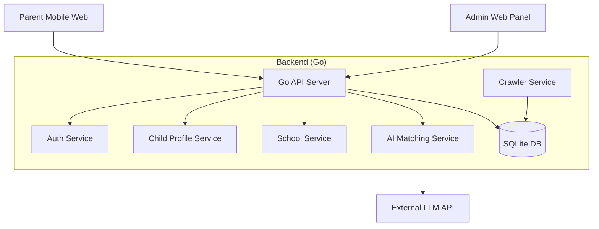

# Hong Kong School Admission System - Technical Design & Implementation Spec

**Last Updated**: 2026-01-04
**Version**: v0.6

## 1. Project Overview (项目概述)
**Goal**: A free, mobile-first tool for Hong Kong parents to track school admission/transfer (插班) information, featuring multi-child profile management and AI-driven school matching.
**目标**: 为香港家长提供一个免费、易用且移动端友好的工具，用于查询、追踪和管理学校插班（Transfer/Admission）信息。

**Core Value & Scenarios (核心价值与场景)**:
1.  **Multi-Child Management (多子女管理)**: Personalized filtering for different grades/genders (e.g., "Find Band 1 Boys' School for S2").
2.  **Information Aggregation (信息整合)**: Centralizes scattered admission info (HTML/PDF) from school websites.
3.  **AI Matching (智能匹配)**: Uses LLM/RAG to match student resumes with school profiles (e.g., "Strong in Piano" -> "Music School").
4.  **Tracking (申请追踪)**: Manage application status (Interested -> Applied -> Offer) in a Kanban-like view.

---

## 2. System Architecture (系统架构)

### 2.1 Tech Stack (技术栈)
| Component | Selection | Status | Details |
| :--- | :--- | :--- | :--- |
| **Language** | Go (Golang) | ✅ Ready | High performance, concurrency for crawler/API |
| **Web Framework** | Gin | ✅ Ready | Lightweight RESTful API |
| **Database** | SQLite | ✅ Ready | Single-file DB, easy maintenance (GORM used) |
| **Auth** | JWT + Mock OTP | ✅ Ready | Stateless token-based auth |
| **Crawler** | GoQuery + Chromedp | ✅ Ready | Generic framework & schooland.hk list crawler implemented |
| **AI/LLM** | OpenAI/Gemini API | ⚠️ Mock | Resume parsing & Chat interface (Mocked) |
| **Frontend** | React + Vite + Tailwind | ⏳ Planned | Mobile-first responsive Web |

### 2.2 Module Diagram (模块图)

---

## 3. Database Schema (数据库设计)

Based on `internal/model/model.go`:

1.  **`users` (用户表)**
    *   `id`: PK
    *   `role`: 'parent' | 'admin'
    *   `identifier`: Phone/Email (Unique)
    *   `password_hash`: (Admin only)

2.  **`child_profiles` (子女档案)**
    *   `id`: PK, `parent_id`: FK -> users.id
    *   `name`: Nickname
    *   `current_grade` (e.g. P6), `target_grade` (e.g. S1)
    *   `gender`: 'M' | 'F'
    *   `target_districts`: CSV string (e.g., "kowloon_city,wan_chai")
    *   `resume_text`: AI-extracted keywords (e.g., "Grade 8 Piano, Math Olympiad")

3.  **`schools` (学校基础表)**
    *   `id`: PK
    *   `name_cn`, `name_en`
    *   `category` (e.g., "Secondary (DSS)"), `banding` (Band 1-3)
    *   `gender` (Boys/Girls/Co-ed), `district` (snake_case)
    *   `popularity`: Integer score (Hotness, increments on user tracking)
    *   `tags`: AI tags (e.g., "Music, Elite, STEM")
    *   `website_home`: Official site
    *   `website_admission`: **Crawler Entry Point**

4.  **`admission_events` (插班活动表)**
    *   `id`: PK, `school_id`: FK
    *   `academic_year`, `target_grade`
    *   `application_start`, `application_end`, `interview_date`
    *   `source_url` (PDF/HTML link), `raw_content`

5.  **`applications` (申请追踪表)**
    *   `id`: PK, `child_id`: FK, `school_id`: FK
    *   `status`: 'interested', 'applied', 'interview', 'offer', 'rejected'
    *   `notes`: User private notes

6.  **`otp_codes`**: Temporary storage for login verification codes.

---

## 4. API & Functional Design (功能与接口)

### 4.1 Authentication (Auth)
*   **Flow**: OTP (SMS/Email) -> JWT Token.
*   `POST /auth/login`: Send Mock OTP (123456).
*   `POST /auth/verify`: Verify and issue JWT.

### 4.2 Child Management (Children)
*   **Feature**: Manage profiles for multiple children to enable personalized recommendations.
*   `POST /children`: Create profile.
*   `GET /children`: List profiles.
*   `GET /children/:id/matches`: **Core Feature**.
    *   Matches schools based on `TargetGrade`, `Gender`, and `TargetDistricts`.
    *   **Logic**: Strict Match -> Fallback to District Match -> Expansion (Sort by Popularity).

### 4.3 School Management (Schools)
*   **Feature**: Searchable school database.
*   `GET /schools`: Search by district, banding, name. Support `sort=popularity`.
*   `POST /schools`: Admin create school.

### 4.4 Application Tracking (Applications)
*   **Feature**: Kanban-like status tracking for parents.
*   `POST /applications`: Track a school. **Side Effect**: Increments school `popularity` score.
*   `GET /applications`: List applications by Child ID.
*   `PUT /applications/:id`: Update status/notes.

### 4.5 AI & Crawler (Advanced)
*   **Crawler**:
    *   `POST /crawl`: Trigger crawler tasks.
    *   **Current State**: Framework ready. `schooland.hk` list crawler implemented.
*   **AI**:
    *   `POST /chat`: Context-aware school query (Mock).
    *   `POST /children/analyze`: Extract profile from text (Simple keyword match implemented).

---

## 5. Implementation Roadmap & Status (实施路线图)

### Phase 1: Infrastructure & DB (✅ Done)
*   Go+Gin Server setup.
*   SQLite+GORM schema design and migration.
*   JWT Auth & OTP flow implementation.

### Phase 2: Core Business Logic (✅ Done)
*   Child Profile CRUD.
*   School Search & Filtering logic.
*   Application Tracking logic.
*   i18n Metadata (Districts/Categories).
*   **Update**: Added `Popularity` field, sorting logic, and automatic increment on application creation.

### Phase 3: Crawler & Data (🚧 In Progress)
*   **Crawler**: `schooland.hk` list parsing implemented for Kindergartens, Primary, and Secondary schools.
*   **Seeding**: Initial top ~90 schools seeded with popularity scores and tags.
*   **Pending**: Deep crawling of specific school admission pages (PDF/HTML date extraction).

### Phase 4: Frontend & AI (⏳ Pending)
*   **Frontend**: React Mobile Web (Login -> Profile -> Match -> Track).
*   **AI**: Real LLM integration for Resume Parsing and RAG (Currently Mock/Simple).
*   **Deployment**: Dockerfile & Docker Compose.
